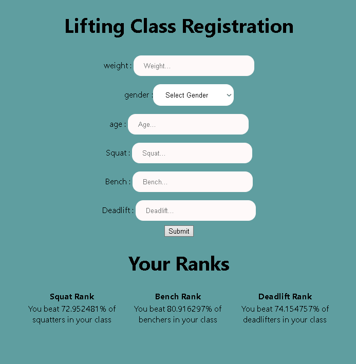

# Powerlifting-Website

This website is a passion project intended to help powerlifters track the progress
of their powerlifting careers. Users are able to determine the ranking of their individual
lifts relative to IPF registered powerlifters across the globe who are in the same lifting
class by entering their lifting stats. Their lifts are compared against data scraped from IPF
records and the percentage of lifters with lower lifts than the user are reported.

Please see the demo below for an example of how the app may be used:

